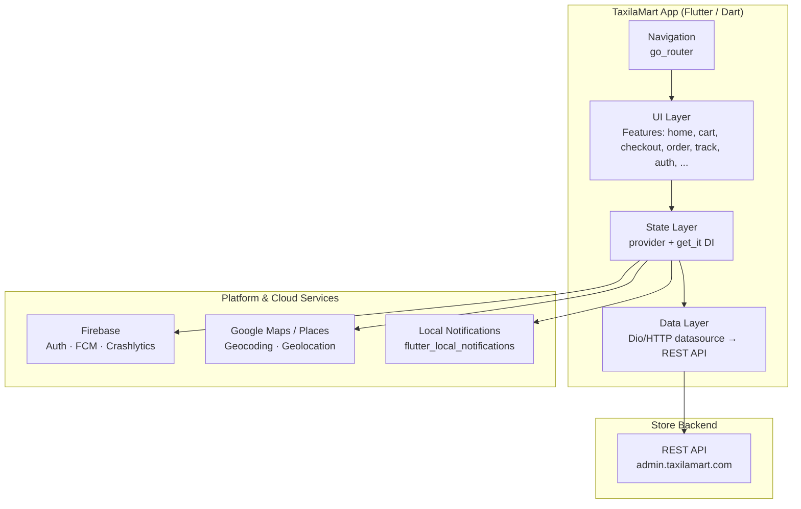

<p align="center">
  
</p>

<p align="center">
  
  
  
  
  
  
</p>

> **Developed by [Arslan Malik](https://github.com/arsalanmaalik461)**
> 📱 WhatsApp: [+92 300 8987448](https://wa.me/923008987448) · 🌐 Website: [arslanmalik.tech](https://arslanmalik.tech)

---

## 🌟 Executive Overview

**TaxilaMart** is a complete cross-platform food & grocery ordering app built with Flutter, shipped for Android, iOS, and the web from a single Dart codebase. The app talks to a remote store backend over a REST API (`admin.taxilamart.com`) and covers the full customer journey — onboarding, product browsing, cart and checkout, live order tracking, ratings, in-app chat, and push notifications.

Under the hood it is a feature-module architecture: 25 feature modules under `lib/features/` (auth, cart, checkout, order, track, flash_sale, coupon, chat, wishlist, and more), state managed with `provider`, dependency injection via `get_it`, and navigation handled by `go_router`. Firebase powers push notifications (FCM), authentication, and Crashlytics reporting, while Google Maps SDKs drive address selection, geocoding, and live order tracking. The app ships with full English and Arabic localizations, dark and light themes, and a responsive layout that adapts to mobile phones and larger screens.

---

## 📑 Table of Contents

- [✨ Key Features & Highlights](#-key-features--highlights)
- [🖥️ Feature Showcase](#️-feature-showcase)
- [🏗️ System Architecture](#️-system-architecture)
- [🚀 Quickstart & Installation Guide](#-quickstart--installation-guide)
- [📂 Project Structure](#-project-structure)
- [🛡️ Security & Notes](#️-security--notes)

---

## ✨ Key Features & Highlights

| Feature | Description |
| :--- | :--- |
| 🛒 Cart & Checkout | Full shopping cart with quantities, coupons, and a guided checkout flow with address and payment selection. |
| 💳 Payment Options | Dedicated payment screens wired to the backend, including in-app webview payments. |
| 📦 Order Management & Live Tracking | Place orders and follow them live on a Google Map, from confirmation to delivery. |
| ⚡ Flash Sale | Time-limited deal module with its own provider, banners, and countdown-ready UI. |
| 🎟️ Coupons & Discounts | Apply promo codes at checkout with validation against the store backend. |
| 🔍 Search & Categories | Typeahead product search plus category browsing with banners and carousel sliders. |
| ⭐ Ratings & Reviews | Rate products and orders and leave reviews after delivery. |
| 💬 In-App Chat | Customer support chat with a third-party chat widget integration. |
| 🔔 Push Notifications | Firebase Cloud Messaging with local notifications, topic subscriptions, and a notification center. |
| 📍 Address & Maps | Google Places autocomplete, geocoding, geolocation, and saved addresses. |
| 🔐 Multi-Method Auth | Email/OTP sign-in plus Google, Facebook, and Apple social sign-in; Firebase Auth support. |
| 🌍 Bilingual (EN / AR) | Full English and Arabic localizations with RTL-ready layout. |
| 🌙 Dark & Light Themes | Complete dark theme and light theme, switchable from settings. |
| 🖥️ Web + Mobile + iOS | One codebase builds to Android, iOS, and a PWA-ready web app (service worker, manifest, install icons). |
| 🛠️ Maintenance Mode | Backend-driven maintenance screen that takes the app offline gracefully when the store is down. |

---

## 🖥️ Feature Showcase

### 1. End-to-End Ordering (Home → Cart → Checkout → Tracking)

> Browse, buy, and track — the complete store journey in one smooth flow.

- Home screen with promotional banners, categories, flash-sale strip, and featured products.
- Cart with quantity controls, saved for the session, and coupon application at checkout.
- Checkout flow with address picker (Google Places), delivery options, and payment method selection.
- Order confirmation followed by live map tracking with driver/status updates.

### 2. Live Order Tracking on Google Maps

> Watch your order move in real time, from the store to your door.

- Dedicated `track` module with its own map provider and order-status polling.
- Google Maps rendering with geocoded store and delivery addresses.
- Status timeline so customers always know where their order stands.

### 3. Engagement Modules (Flash Sale, Coupons, Wishlist, Reviews)

> Keep customers coming back with deals, lists, and feedback loops.

- Flash-sale section with time-boxed offers pulled from the backend.
- Coupon system with validation and discount application at checkout.
- Wishlist for saving favorite products, with shimmer-loading placeholders.
- Post-delivery rating and review flow with product and order feedback.

### 4. Account, Notifications & Support

> Everything a returning customer needs, one tap away.

- Profile management, order history, address book, and notification preferences.
- Firebase push notifications routed into an in-app notification center.
- In-app customer chat plus a support/FAQ section and HTML info pages (about, terms, privacy).

---

## 🏗️ System Architecture



The app follows a feature-first layout: each module under `lib/features/` owns its screens, widgets, and providers. Shared models, widgets, repositories, and helpers live under `lib/common/` and `lib/helper/`. All server communication goes through the data layer to the backend REST API whose base URL is configured in `lib/utill/app_constants.dart`.

---

## 🚀 Quickstart & Installation Guide

### Prerequisites

- Flutter SDK **3.4 or newer** (Dart `>=3.4.0 <4.0.0`, per `pubspec.yaml`)
- Android Studio / Xcode for mobile builds (or Chrome for web)
- A Firebase project with `google-services.json` (Android) and `GoogleService-Info.plist` (iOS) if you want push notifications and Crashlytics — iOS config is already scaffolded in `ios/`
- A running TaxilaMart store backend, or point `baseUrl` in `lib/utill/app_constants.dart` at your own server

### Step-by-Step Installation

```bash
# 1. Clone the repository
git clone https://github.com/arsalanmaalik461/TaxilaMart.git
cd TaxilaMart

# 2. Fetch dependencies
flutter pub get

# 3. (Optional) Generate platform-specific Firebase config
#    Place google-services.json in android/app/ for Android push support

# 4. Run on a device, emulator, or the web
flutter run

# Build release artifacts
flutter build apk --release        # Android
flutter build appbundle --release # Play Store
flutter build ipa --release       # iOS
flutter build web --release       # Web (PWA)
```

> **Backend note:** the app is a client — it expects the store REST API at the `baseUrl` configured in `lib/utill/app_constants.dart` (default `https://admin.taxilamart.com`). Update it to your own backend before release builds.

---

## 📂 Project Structure

```
TaxilaMart/
├── android/                 # Android native shell (Kotlin/Gradle, Firebase plugins)
├── ios/                     # iOS native shell (Runner, Firebase config)
├── web/                     # Web build (index.html, PWA manifest, FCM service worker)
├── assets/                  # App assets
│   ├── icon/  image/  svg/  # Icons, images, vector graphics
│   ├── fonts/               # Exo font family (Regular/Medium/SemiBold/Bold)
│   ├── language/            # en.json, ar.json localizations
│   └── notification.wav     # Notification sound
├── lib/
│   ├── main.dart            # App entry: providers, router, Firebase, themes
│   ├── di_container.dart    # get_it dependency injection setup
│   ├── firebase_options.dart# Firebase platform options
│   ├── features/            # 25 feature modules, each with screens/widgets/providers
│   │   ├── auth/  onboarding/  splash/  welcome_screen/
│   │   ├── dashboard/  home/  category/  product/  search/
│   │   ├── cart/  checkout/  payment/  coupon/  flash_sale/
│   │   ├── order/  track/  rate_review/  wishlist/
│   │   ├── chat/  address/  notification/  profile/  menu/
│   │   └── language/  support/  html/  maintanance/  update/
│   ├── common/              # Shared models, widgets, repositories, enums
│   ├── data/                # Datasource layer (API clients)
│   ├── helper/              # ApiChecker, CartHelper, PriceConverter, NotificationHelper, ...
│   ├── provider/            # Global providers (theme, localization, language, news)
│   ├── localization/        # AppLocalization + language constants
│   ├── theme/               # dark_theme.dart, light_theme.dart
│   └── utill/               # App constants (appName, baseUrl), routes, dimensions
├── docs/
│   └── assets/
│       └── banner.svg       # Project banner (this README's header)
├── test/                    # Widget tests
├── pubspec.yaml             # Dependencies (provider, dio, firebase_*, google_maps_*, ...)
├── pubspec.lock
└── analysis_options.yaml    # Dart/Flutter lint rules
```

---

## 🛡️ Security & Notes

- **API base URL is configurable** in `lib/utill/app_constants.dart` — never hardcode production secrets elsewhere; keep keys out of version control.
- **Firebase credentials:** `google-services.json` / `GoogleService-Info.plist` are environment-specific — use your own Firebase project for production builds.
- **HTTP overrides:** `main.dart` installs a custom `HttpOverrides` on mobile; review certificate handling before shipping to production.
- **Web PWA:** `web/` includes a Firebase Messaging service worker and PWA manifest — serve over HTTPS for push and installability.
- **Backend dependency:** this repository is the client app only; the store backend (products, orders, payments) is a separate service the app consumes via REST.

---

<p align="center">
  <b>TaxilaMart</b> · Developed by <a href="https://github.com/arsalanmaalik461">Arslan Malik</a><br>
  📱 <a href="https://wa.me/923008987448">+92 300 8987448</a> · 🌐 <a href="https://arslanmalik.tech">arslanmalik.tech</a>
</p>
